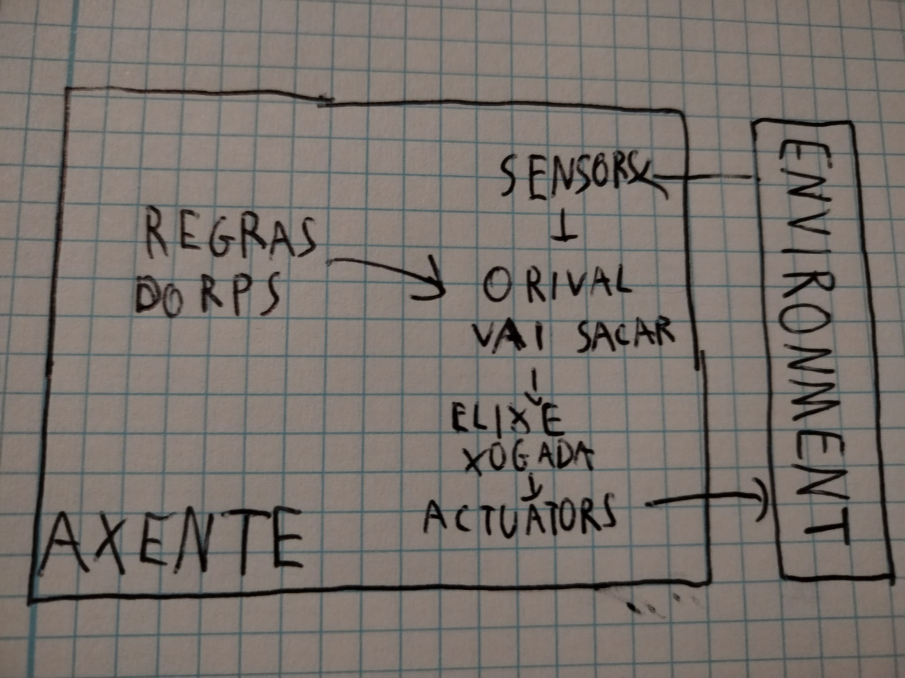
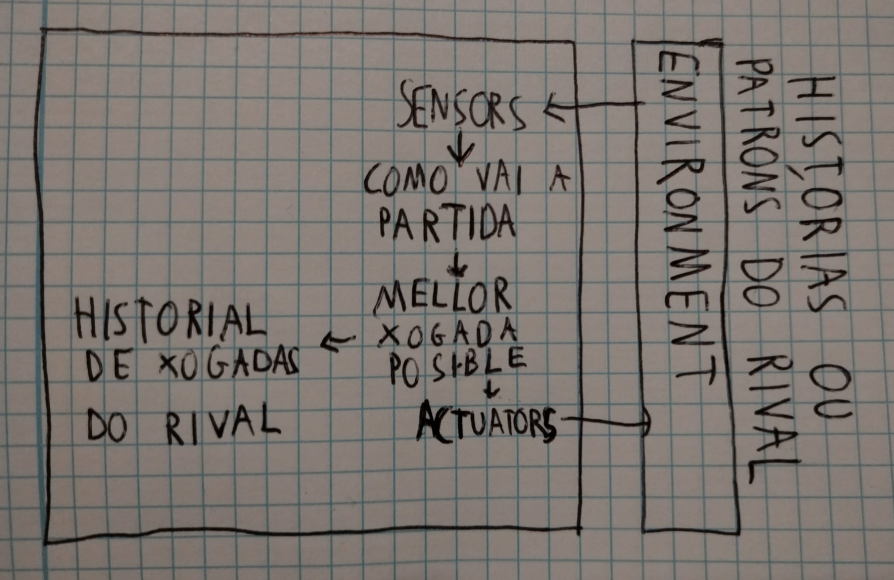

## 1.Especificación do contorno de tarefas

Especifica as características do contorno de tarefas do RPS e xustifica a túa resposta, segundo o epígrafe _"2.3.2 Properties of task environments"_ do capítulo 2 _Intelligent Agents_ do libro _IA: A modern approach, Russell & Norvig_.

Resume as características do contorno nunha táboa co formato:

Contorno de tarefas | Observable| Axentes | Determinista | Episódico | Estático | Discreto | Coñecido
:---: | :---: | :---: | :---: | :---: | :---: | :---: | :---: |
 RPS | Partially | Multi | Stochastic | Episodic | Static |  Discrete |  Known |

**Observable:** Considero que só é parcialmente observable, debido a que o axente non sabe cal será a xogada do ser human antes de elixir, polo que non ten tódala información do entorno.

**Axentes:** É multiaxente, dado que temos a dous xogadores, o humano e a IA. 

**Determinista:** Aínda que as reglas do xogo son deterministas, coma a IA non sabe que vai a facer o humano, isto é impredicible para ela, polo que sería estocástico.

**Episódico:** Cada ronda é independente, non afecta á seguinte(A non ser que a IA teña un algoritmo programado para detectar patróns nas xogadas e axustar a súa estratexia, nese caso sería secuencial).

**Estático:** O entorno non cambia mentres o axente decide, é estático.

**Discreto:** Hai 3(ou 5, con RPSLS) accións dispoñibles, é discreto.

**Coñecido:** As regras do xogo están claramente definidas, polo que son coñecidas pola IA.

No libro atoparás unha táboa semellante:

Exemplos contornas de tarefas.

## 2.Identificación do tipo de axente e estrutura

O noso propósito é deseñar o **programa axente** que implementa a **función axente** ou a **función que mapea** as percepcións a accións. 

A partires do modelo xeral de axente intelixente da figura:

**debuxa un modelo adecuado** ao contorno de tarefas e a un dos catro **tipos de programas axente**:

- Axentes reactivos simples
- Axentes reactivos baseados en modelos.
- Axentes baseados en obxectivos.
- Axentes baseados en utilidade.

Cada clase de axente combina compoñentes particulares dun modo particular para xerar as accións. 

Elixo os dous modelos que considero máis adecuados para este axente.

## Axente reactivo simple

É adecuado para o que queremos porque dependendo da estratexia que usemos o axente pode non requerir memoria ao xogar aleatoriamente ou só reaccionando ás xogadas do rival.

## Axente baseado en utilidade

Con este modelo o axente pode calcular as probabilidades, escoller a xogada que maximiza as probabilidades de victoria(Estudando os movementos do rival segundo as xogadas que máis saca e os patróns de cando está a facer a mesma xogadas repetidas veces) e é máis intelixente que o reactivo.

## 3. Implementación en Python

A estratexia pola que fixen que funcione o axente é que garde as 5 últimas xogadas e xogue contra a xogada máis usada destas. Se vei que nestas 5 últimas xogadas perdeu máis do que gañou e empatou, pasa a xogar contra a xogada máis usada en xeral. Tamén hai unha probabilidade do 25% de que faga unha xogada aleatoria. Por último, se detecta que o xogador fixo dúas veces a mesma xogada predecirá que vai a sacar outra vez o mesmo e sacará a súa contra.

Con esta estratexia a IA continúa a adaptarse ao estado actual da partida e a aleatoriedade e cambio de estratexia axudan a que non se lle poda predicir con tanta doadez, está feita especificamente para contrarestar a xogadores que tenten atopar patróns doados de estoupar no seu comportamento. Sen embargo, o seu rendemento baixa moito contra aqueles que saquen aleatoriamente ou non o pensen demasiado.

## 4.Extensión ao RPS + Lizzard Spock

A extensión foi realizada correctamente, e segundo coma está plantexado o proxecto, incluso seria posible engadir máis xogadas posibles sen demasiado problema.

## Guía de instalación e uso.

Pódese instalar este proxecto instalando o zip no botón <>code da súa páxina ou usando git clone https://github.com/LucasTbln/RPS_Meu en git. Para usalo, hai que ter aberto o proxecto en VS code e pulsar start debugging ou en RPS_Meu.py ou en RPSLS_Meu.py